## Table of Contents
- [Overview](#overview)
- [Example Use Cases](#example-use-cases)
  - [1. Patient-Level Aggregation](#1-patient-level-aggregation)
  - [2. Longitudinal Time Series Construction](#2-longitudinal-time-series-construction)
- [Notable Requirements](#notable-requirements)
- [Features](#features)
- [📊 Diagrams](#-diagrams)
  - [System Architecture & Configuration](#system-architecture--configuration)
  - [Data Pipelines](#data-pipelines)
  - [Methods & Post-Processing](#methods--post-processing)
  - [Feature Extraction](#feature-extraction)
- [Installation](#installation)
  - [Windows](#windows)
  - [Unix/Linux](#unixlinux)
    - [Option 1: Install All Requirements Automatically](#option-1-install-all-requirements-automatically)
    - [Option 2: Manual Installation](#option-2-manual-installation)
- [Usage](#usage)
- [Contributing](#contributing)
- [License](#license)


# Overview

This tool converts individual patient records into structured time-interval feature vectors, making them suitable for filtering, aggregation, and assembly into a data matrix **D** for binary classification machine learning tasks.

## Example Use Cases

### 1. Patient-Level Aggregation  
Compute summary statistics (e.g., the mean of *n* variables) for each unique patient, resulting in one row per patient. This is ideal for models requiring a single representation per individual.

### 2. Longitudinal Time Series Construction  
Generate a monthly time series for each patient that includes:

- Biochemistry results  
- Demographic attributes  
- MedCat-derived clinical text annotations  

The time series spans up to 25 years retrospectively, aligned to each patient's diagnosis date, enabling a consistent retrospective view across varying start times.

## Notable requirements:

- CogStack (cogstack_v8_lite) ([cogstack_search_methods](https://github.com/SamoraHunter/cogstack_search_methods))
- Elasticsearch
- MedCat https://github.com/CogStack/MedCAT
- Python >=3.10
- Python3.10-venv (for install_pat2vec.py)

See requirements.txt

## Features:

- Single patient
- Batch patient
- Cohort search and creation
- Automated random controls
- Modular feature space selection
- Look back
- Look forward
- Individual patient time windows. 

## 📊 Diagrams

This project includes a collection of diagrams illustrating the system architecture, data pipelines, ingestion examples, and method workflows.  
You can view the Mermaid definitions or the rendered diagrams below.

### 📂 System Architecture & Configuration
| Diagram | Mermaid | Image |
|---|---|---|
| **System Architecture** | [assets/system_architecture.mmd](assets/system_architecture.mmd) |  |
| **Configuration** | [assets/config.mmd](assets/config.mmd) |  |

---

### 🛠️ Data Pipelines
| Diagram | Mermaid | Image |
|---|---|---|
| **Data Pipeline** | [assets/data_pipeline.mmd](assets/data_pipeline.mmd) |  |
| **Main Batch Processing** | [assets/main_batch.mmd](assets/main_batch.mmd) |  |
| **Example Ingestion** | [assets/example_ingestion.mmd](assets/example_ingestion.mmd) |  |

---

### 🧩 Methods & Post-Processing
| Diagram | Mermaid | Image |
|---|---|---|
| **Methods Annotation** | [assets/methods_annotation.mmd](assets/methods_annotation.mmd) |  |
| **Post-Processing Build Methods** | [assets/post_processing_build_methods.mmd](assets/post_processing_build_methods.mmd) |  |

---

### 🔍 Feature Extraction
| Diagram | Mermaid | Image |
|---|---|---|
| **Ethnicity Abstractor** | [assets/ethnicity_abstractor.mmd](assets/ethnicity_abstractor.mmd) |  |
| **Get BMI** | [assets/get_bmi.mmd](assets/get_bmi.mmd) |  |
| **Get Demographics** | [assets/get_demographics.mmd](assets/get_demographics.mmd) |  |
| **Get Diagnostics** | [assets/get_diagnostics.mmd](assets/get_diagnostics.mmd) |  |
| **Get Drugs** | [assets/get_drugs.mmd](assets/get_drugs.mmd) |  |
| **Get Smoking** | [assets/get_smoking.mmd](assets/get_smoking.mmd) |  |
| **Get News** | [assets/get_news.mmd](assets/get_news.mmd) |  |
| **Get Dummy Data Cohort Searcher** | [assets/get_dummy_data_cohort_searcher.mmd](assets/get_dummy_data_cohort_searcher.mmd) |  |
| **Get Method Bloods** | [assets/get_method_bloods.mmd](assets/get_method_bloods.mmd) |  |
| **Get Method Patient Annotations** | [assets/get_method_pat_annotations.mmd](assets/get_method_pat_annotations.mmd) |  |
| **Get Treatment Docs (No Terms Fuzzy)** | [assets/get_treatment_docs_by_iterative_multi_term_cohort_searcher_no_terms_fuzzy.mmd](assets/get_treatment_docs_by_iterative_multi_term_cohort_searcher_no_terms_fuzzy.mmd) |  |


## Installation

### Windows:

1. **Clone the repository:**
    cd to gloabl_files
   
    ```shell
    git clone https://github.com/SamoraHunter/pat2vec.git
    cd pat2vec
    ```

    **Run the installation script:**
    ```shell
    install.bat
    ```

3. **Add the `pat2vec` directory to the Python path:**

   Before importing `pat2vec` in your Python script, add the following lines to the script, replacing `/path/to/pat2vec` with the actual path to the `pat2vec` directory inside your project:
   
    ```python
    import sys
    sys.path.append('/path/to/pat2vec')
    ```

4. **Import `pat2vec` in your Python script:**

    ```python
    import pat2vec
    ```

### Unix/Linux:

### **Option 1: Install All Requirements Automatically**  
This option installs `pat2vec` along with its dependencies, including:  
- `pat2vec_env` (virtual environment)  
- `snomed_methods`  
- `cogstack_search_methods`  
- `clinical_note_splitter`  

Before running the installation, ensure you:  
- Place the **model pack** in the appropriate directory  gloabl_files/medcat_models/%modelpack%.zip
- Populate the **credentials file**  under gloabl_files/credentials.py
- *(Optional)* Add a **SNOMED file** if needed  gloabl_files/.. 'snomed', 'SnomedCT_InternationalRF2_PRODUCTION_20231101T120000Z', 'SnomedCT_InternationalRF2_PRODUCTION_20231101T120000Z', 'Full', 'Terminology', 'sct2_StatedRelationship_Full_INT_20231101.txt'

### **Installation Steps:**  

1. Copy the `install_pat2vec.sh` file to your installation directory.  
2. Grant execution permissions:  
   ```sh
   chmod +x install_pat2vec.sh
   ```  
3. Run the installation using one of the following options:  

   - **Standard installation:**  
     ```sh
     ./install_pat2vec.sh
     ```  
   - **Installation with proxy mirror support:**  
     ```sh
     ./install_pat2vec.sh --proxy
     ```  
   - **Install to a specific directory:**  
     ```sh
     ./install_pat2vec.sh --directory /path/to/install
     ```  
   - **Skip cloning repositories (if already cloned manually):**  
     ```sh
     ./install_pat2vec.sh --no-clone
     ```  

### **Repositories Installed by This Script:**  
The script will clone the following repositories:  
- [`pat2vec`](https://github.com/SamoraHunter/pat2vec.git)  
- [`snomed_methods`](https://github.com/SamoraHunter/snomed_methods.git)  
- [`cogstack_search_methods`](https://github.com/SamoraHunter/cogstack_search_methods.git)  
- [`clinical_note_splitter`](https://github.com/SamoraHunter/clinical_note_splitter.git)  

---

## **Option 2: Manual Installation**

1. **Clone the repository:**
    ```shell
    git clone https://github.com/SamoraHunter/pat2vec.git
    ```
    
    . **Run the installation script:**
    
    ```shell
    (Requires python3 on path and venv)
    chmod +x install.sh
    ./install.sh
    ```
    
    cd pat2vec
    ```

2. **Add the `pat2vec` directory to the Python path:**

   Before importing `pat2vec` in your Python script, add the following lines to the script, replacing `/path/to/pat2vec` with the actual path to the `pat2vec` directory inside your project:
   
    ```python
    import sys
    sys.path.append('/path/to/pat2vec')
    ```

3. **Import `pat2vec` in your Python script:**

    ```python
    import pat2vec
    ```


## Usage:

- Set paths, gloabl_files/medcat_models/modelpack.zip, gloabl_files/snomed_methods, gloabl_files/..

- gloabl_files/
    - medcat_models/
        - modelpack.zip
    - snomed_methods/snomed_methods_v1.py**
    - pat2vec/
    - pat2vec_projects/
        - project_01/
            - example_usage.ipynb
            - treatment_docs.csv
 
*treatment_docs.csv should contain a column 'client_idcode' with your UUID's. 
**https://github.com/SamoraHunter/SNOMED_methods.git

- Configure options

- Run all

- Examine example_usage.ipynb for additional functionality and use cases.

- open example_usage.ipynb and hit run all.

- If testing in a live environment ensure the testing flag is set to False in the config_obj.
- 


## Contributing
Contributions are welcome! Please see the contributing guidelines for more information.

## License
This project is licensed under the MIT License - see the LICENSE file for details

