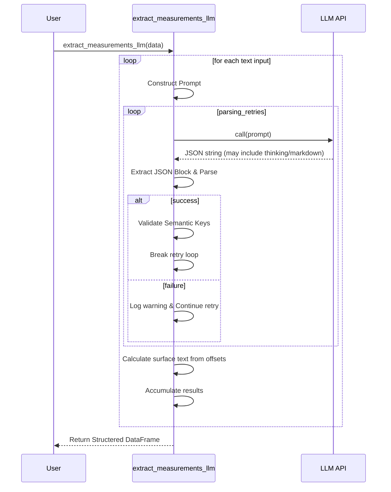

# LLM Measurement Extraction

The `extract_measurements_llm` utility leverages Large Language Models to identify and structure clinical measurements found within free-text medical records. Unlike rule-based extractors, the LLM approach provides deep semantic context, identifying not just the number and unit, but exactly what is being measured (e.g., differentiating between a biopsy size and a tumor diameter).

## Core Capabilities

*   **Structured Extraction**: Converts raw text mentions into a standardized schema (Value, Unit, Dimension, Context).
*   **Unit Inference**: Intelligently infers units when they are omitted but clinically implied (e.g., 'BP 120/80' → 'mmHg').
*   **Semantic Disambiguation**: Uses the model's clinical knowledge to populate the `entity_context` (e.g., "Temp", "LVIDd", "Lesion diameter").
*   **Robust Parsing**: Handles reasoning model outputs (thinking blocks), markdown formatting, and preamble/postamble text to extract valid JSON.

## How It Works

The extraction process follows a structured workflow designed for high reliability:

1.  **Input Normalization**: Accepts DataFrames, Series, Lists, or single Strings.
2.  **Prompt Engineering**: Uses a specialized prompt that enforces a strict JSON schema and provides clinical rules for inference.
3.  **LLM Invocation**: Calls the provided `llm_caller` function.
4.  **JSON Recovery**: Searches for the outermost JSON array or object in the response, stripping thinking blocks (e.g., `<think>`) and markdown code delimiters.
5.  **Validation & Retry**: If the JSON is malformed or missing required semantic keys, the system retries up to the configured `parsing_retries` (default 3).
6.  **Schema Mapping**: Maps the extracted JSON fields to the standard `pat2vec` measurement output schema.

### Sequence Diagram



## Usage Example

```python
from pat2vec.util.llm.llm_measurement_extraction import extract_measurements_llm
import pandas as pd

# Define a simple caller for your LLM (e.g., Ollama or OpenAI)
def my_llm_caller(prompt):
    return model.invoke(prompt).content

# Input data
df = pd.DataFrame({
    "body_analysed": [
        "Patient is 80kg. BP recorded at 140/90. Temperature 38.2C.",
        "Biopsy size 2.1 x 1.5 cm."
    ]
})

# Run extraction
measurements_df = extract_measurements_llm(
    data=df,
    llm_caller=my_llm_caller,
    text_column="body_analysed",
    verbose=1
)
```

## Output Schema

The function returns a `pd.DataFrame` with the following columns:

| Column | Description |
| :--- | :--- |
| **original_text_index** | The index of the row in the source data. |
| **original_text_column**| The name of the column processing text (if from a DataFrame). |
| **surface** | The actual substring found in the text (calculated via LLM offsets). |
| **value** | The numeric part of the measurement. |
| **unit_name** | The name/symbol of the unit (e.g., 'kg', 'mmHg'). |
| **dimension** | The category of measurement (e.g., 'mass', 'blood pressure'). |
| **entity_context** | Semantic description (e.g., 'Weight', 'Systolic', 'Diastolic'). |
| **char_start / char_end**| Integer character offsets within the source text. |
| **llm_raw_response** | The full text returned by the model (useful for debugging). |
| **llm_error** | Details on why a row failed extraction or validation. |
